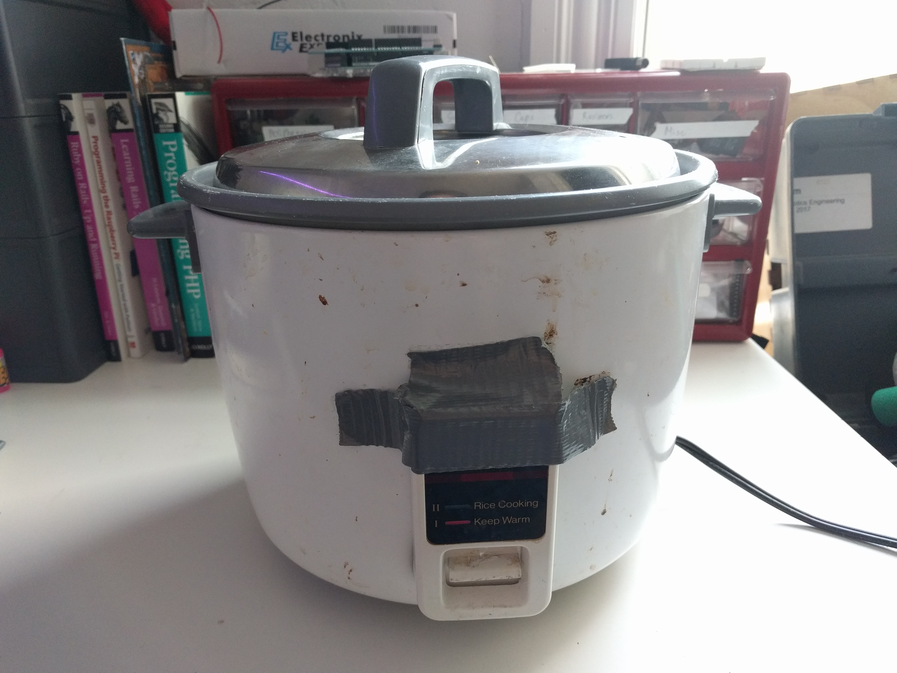
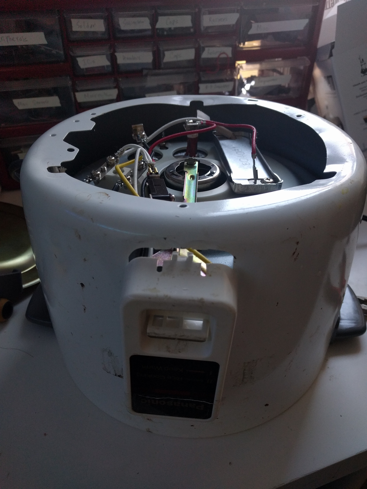
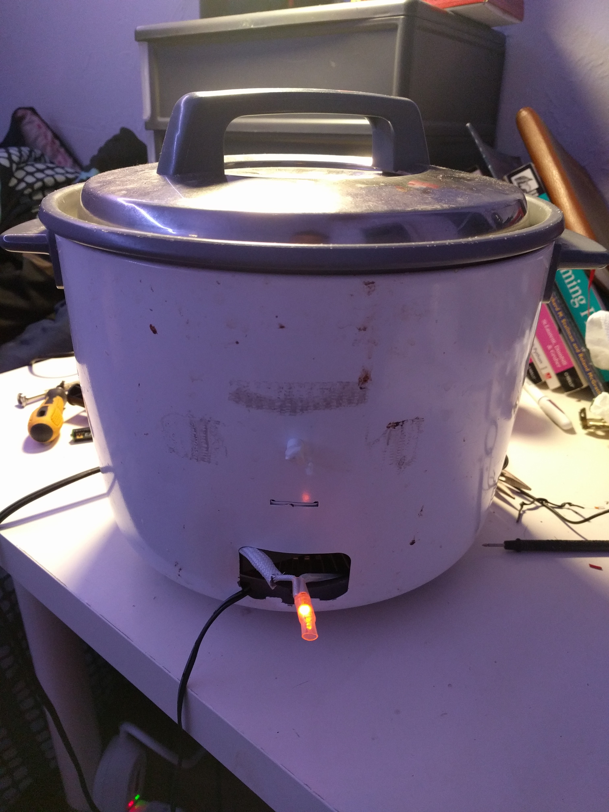
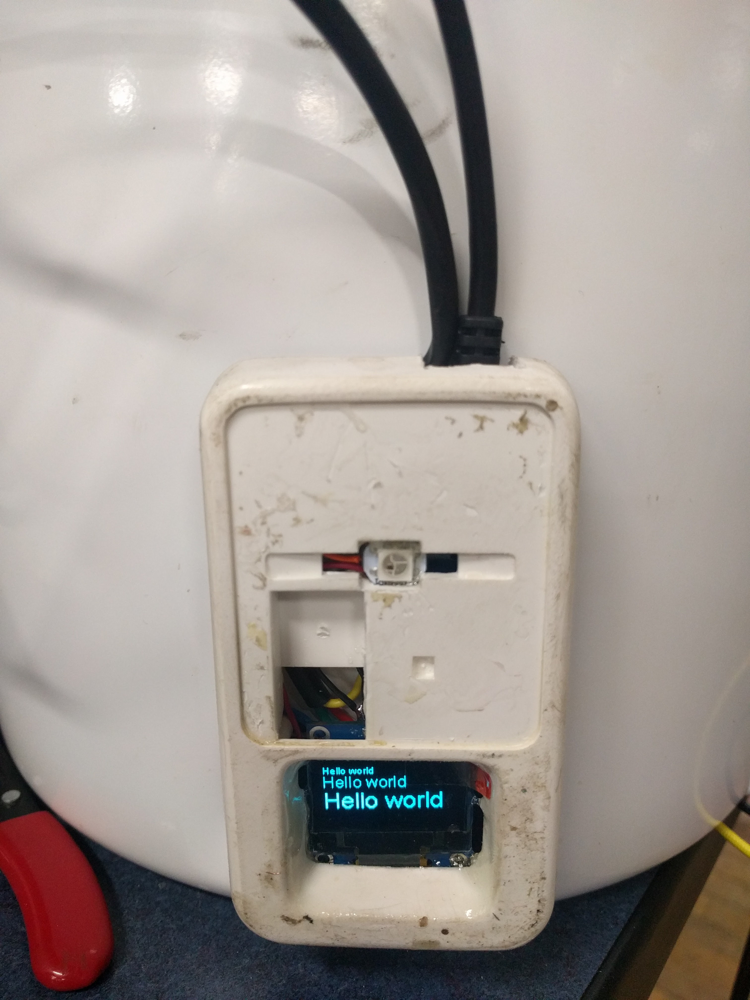
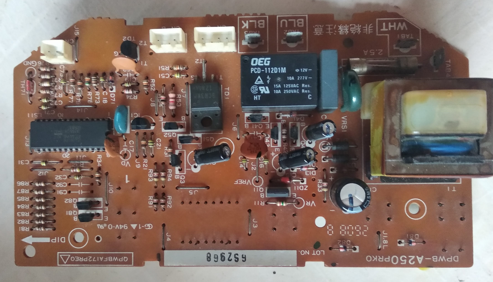
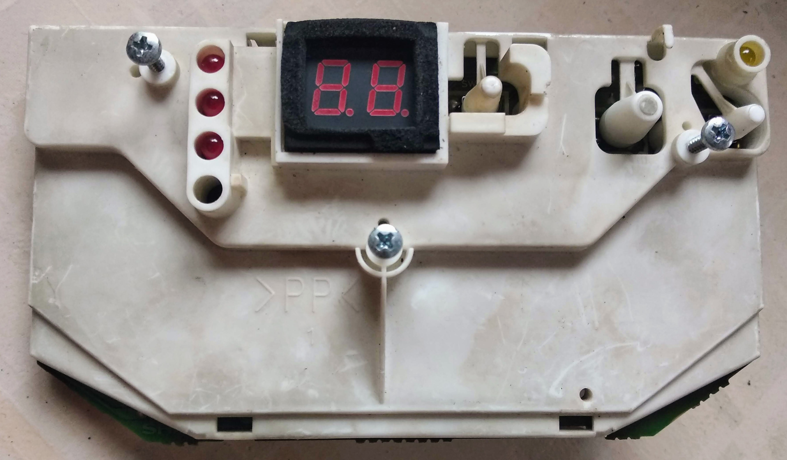

# A Very Sous Vide Odyssey

by namt, May 4th, 2019

Back in late 2017 I got a chance to make a sous vide machine out of an old, cheap rice cooker. I took out most of the internals, including the thermistor, then hooked up the heating element to an ESP8266 with an OLED, DS18B20 Temperature sensor, and an SSR Relay.

_Original rice cooker, courtesy of my old roommate_

I programmed it in Arduino, and it worked. Somewhat. It was a hack job and it wasn't even possible to change the target temperature on the fly as it was hard coded. But it worked well enough to make me some delicious lamb chops to impress my girlfriend's parents.

_Gutting the poor thing_

_Totally safe wiring_

_The finished product_

Shortly after, I had to move and with heavy stomach, I took apart the contraption. I am determined to pick it up again some other time.

## Mark II
After moving back to Vietnam, I came across this old Sharp rice cooker at a flea market. It's fully functional, and for the low low price of 200,000 VND ($8.65, what a steal!) 

_From left to right: lid, body, bottom_

New models go for [1.490.000 VND](https://mediamart.vn/noi-com-dien/sharp/noi-com-dien-18l-ks-zt18.htm) ($64!!!) 

I took apart the internals and other than minor scrapes and bruises it was chugging along just fine. The heart of the control board was a ___ 4-bit microcontroller. Along with it there's circuitry for a full bridge rectifier, a high power MOSFET, relay, and three JST connectors for the heating coil, secondary lid heating coil, and thermistor.

_The control board_

_Control board, backside_

I didn't intend to keep the chip - at this time I plan to design a new PCB that would replace the old one. I plan to add an LCD display, a rotary encoder to control the menu, and a more powerful microcontroller.

Since I am learning more about STM32, I decided on the STM32F030F4P6, one of the cheapest STM32s out there. 