# Tackling the Aoycocr Smart Bulb

by namt, Nov 12, 2019

I was browsing Amazon today and this [little bulb](https://www.amazon.com/gp/product/B07NXR61Y2/) caught my eye. 2 for $12! And one of the commenters mentioned it's running the ever-ubiquitous ESP8266 board. I ordered as fast as I could and it arrived the next day. After my [diyHue](https://diyhue.org/) setup (which costs a whooping $0, using parts laying around), this will be a perfect low-cost way of RGB-up my apartment. 

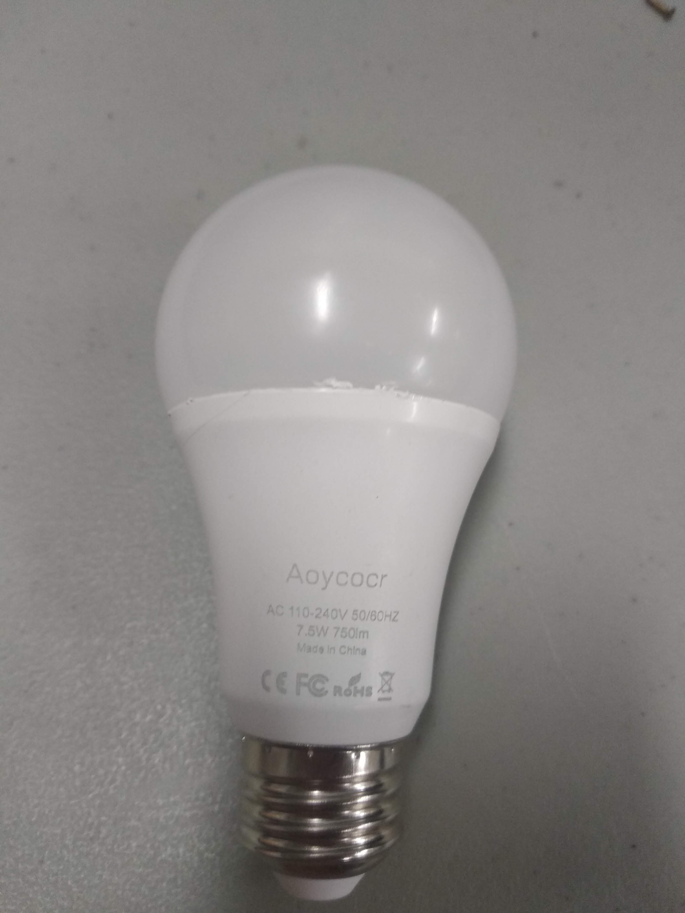_The bulb_

The bulb came in a package of 2, calling itself __Aoycocr__ (which is a mouthful) - even though this name did not show up on the packaging. It claims to work with Alexa & Google Home Assistant, No Hub Required, furthermore confirming the fact that this is an ESP-based light bulb. 

The top can be taken off easily by taking an Xacto knife and tracing the outside of the frosted plastic part, then twist the bulb off. It was glued in using a white epoxy which I suspect is silicone based. 

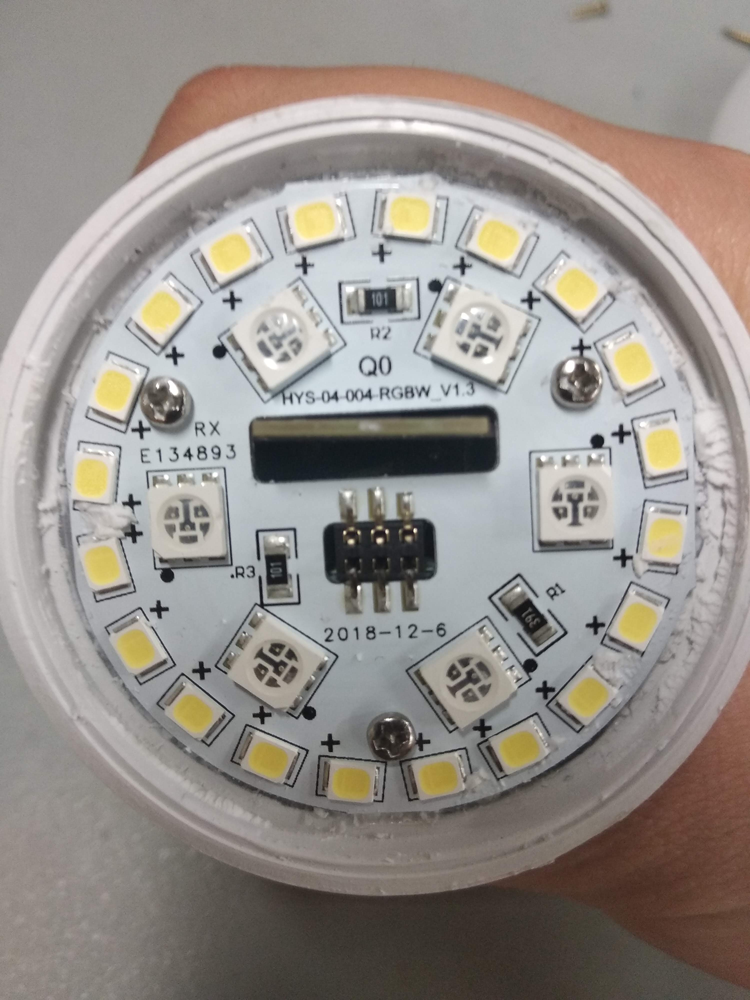_The insides_

Taking off the top gives us a view of what's inside. The PCB on top consists of 20 white LEDs and 6 RGB LEDs, which suspiciously looks like the infamous WS2812/WS2811 line. The board is connected to the controller boards at a 90 angles by 2x3 male pin headers. 

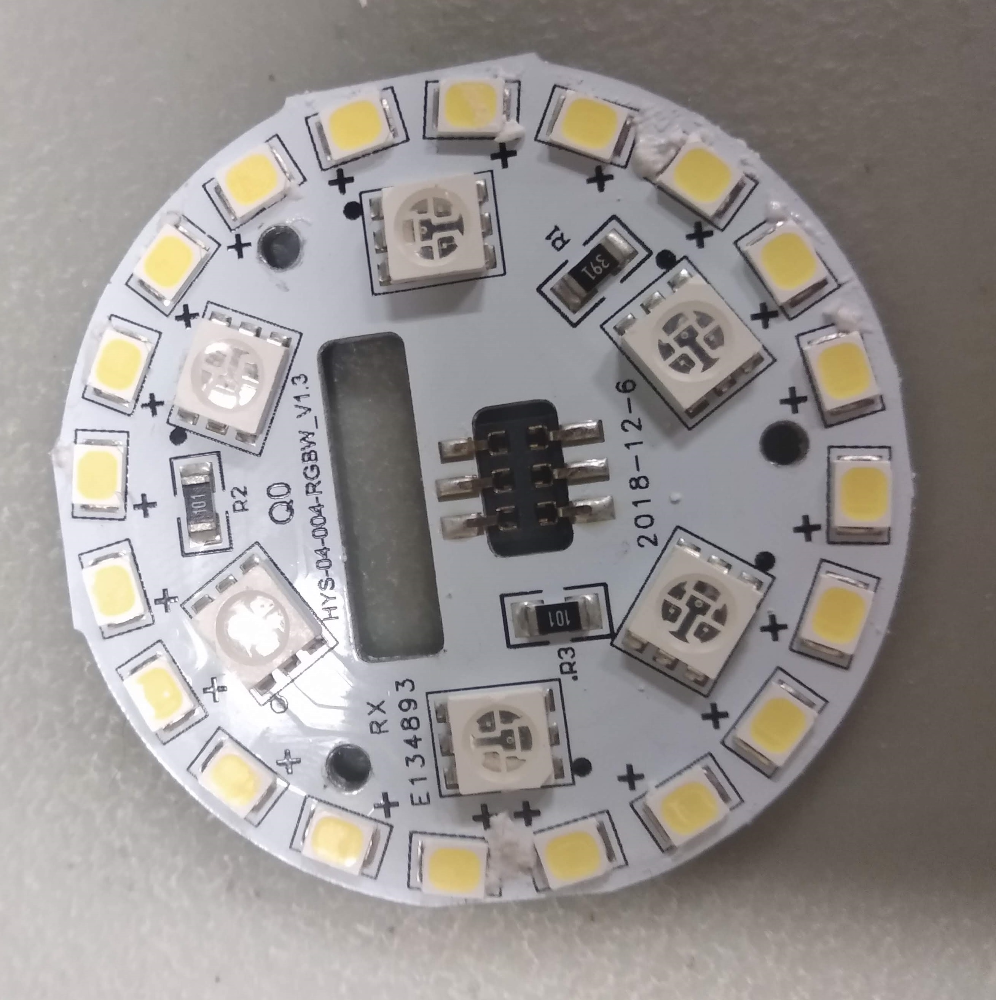_Top PCB_

Taking off the top reveals two PCB, the green one looks like power management and the white one with the antenna traces looks like our wonderful friend ESP8266.

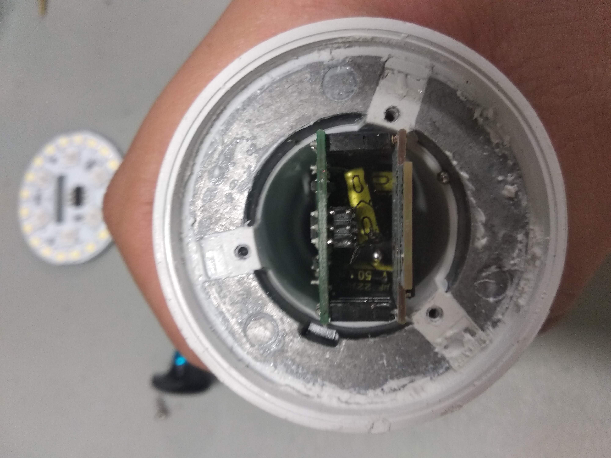_Top off_

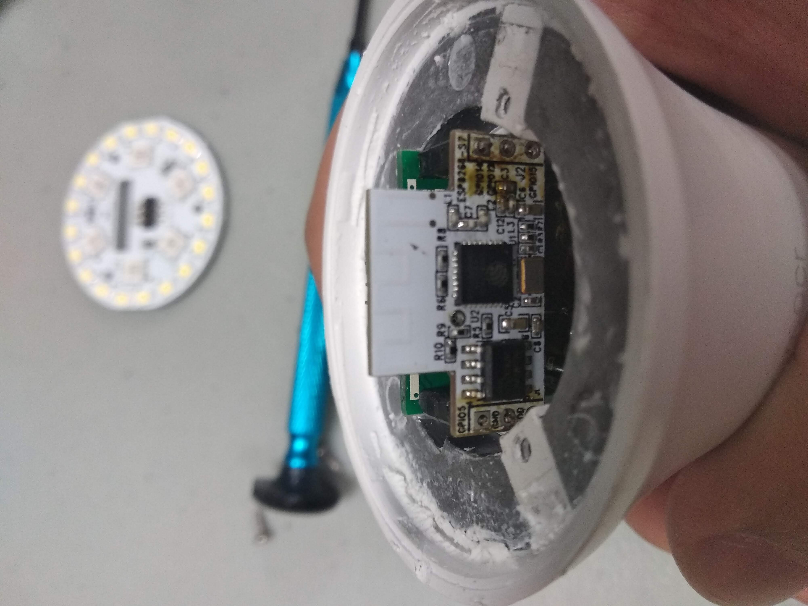_Side view_

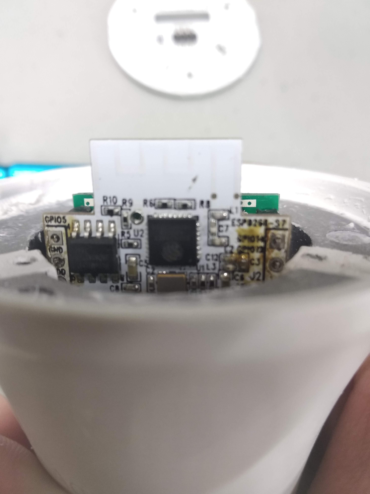_Top view_

A closer inspection shows us that [![it's the one we're looking for!]]((http://img.youtube.com/vi/PDZcqBgCS74/0.jpg)](http://www.youtube.com/watch?v=PDZcqBgCS74)
)

The markings gave us [ESP8266-EX](https://www.espressif.com/sites/default/files/documentation/0a-esp8266ex_datasheet_en.pdf), a QFN32 package version of the usual ESP chip. I suspect they went with this one for sizing reasons all the while wanting to keep the price low. Knowing this I suspect I could find an even cheaper version of the bulb (that's not on Amazon) however I'm not much one for waiting for cool electronic gadgets, so Amazon will have to do. 

Next to the ESP8266 is another chip that I found out to be an SPI Flash! What a pleasant surprise. It's a [Boya Micro BY25D40AS](http://www.boyamicro.com/English/Product/017936210.html) chip. The BY25D40AS can supply 4M of flash memory to the ESP, which makes features such as OTA updates available. 

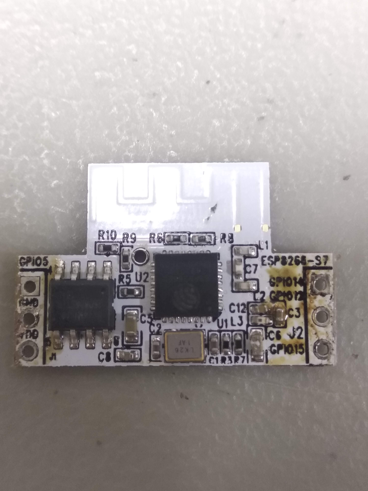_Closeup_

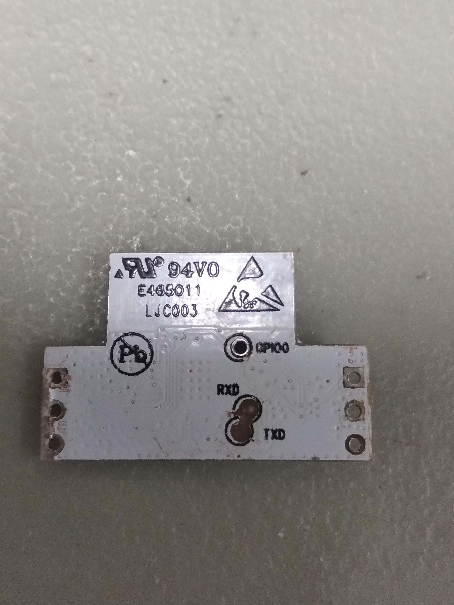_Bottom view_

And on the bottom side we can see the test pads! Rx, Tx, and a convenient GPIO0 for reset. All we need to do now is to hook up the necessary wires and take a nice long look at our serial port.

If you have been paying attention you may realize that this board has been viciously murdered and horribly desoldered from its original position. That's because in the process of soldering the Rx & Tx wires I accidentally pulled the pads out. It's a tough to reach spot and the two boards are connected using standoffs, so there's not a really ideal way of salvaging it. Instead I snipped off the legs entirely and use it as a reference for my remaining light bulb.

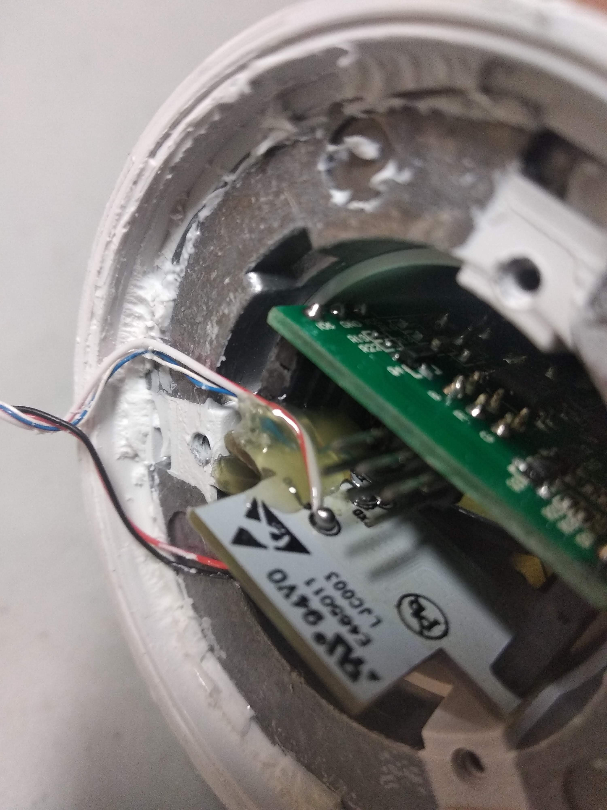_Successfully Soldered!_

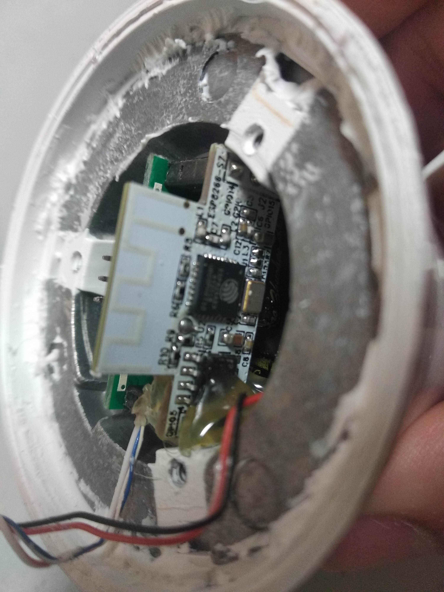

With a little help from my friend Bill of the WPI ECE shop and his incredibly stable fingers, we managed to solder some hookup wires to the chip.

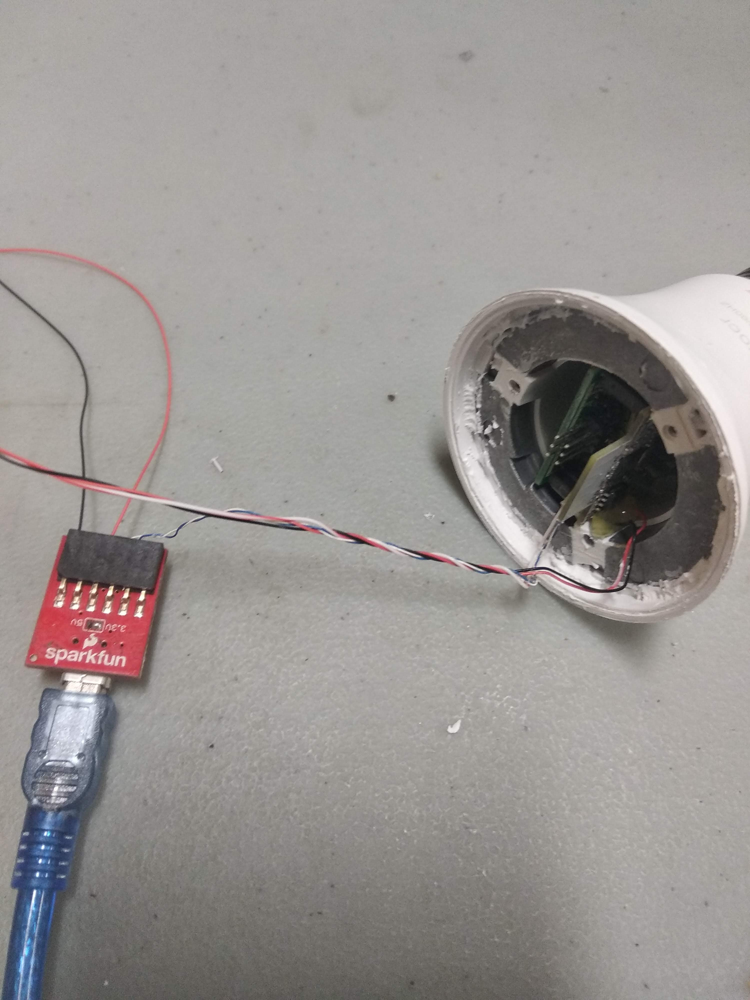

Hooking the board up to an FTDI chip and we're good to go. The ESP8266 operates on a 3.3V logic level so it's important that we do not hook it up to the 5V line. 

Our connection is: 

White 		-> Rx
Blue 		-> Tx
Red 		-> Vcc
Black		-> GND
Red & white -> Reset (GPIO0)

```
scandone
[notice]device.c:1588 
FW Compiled Time Apr 17 2019 17:28:36

[notice]device.c:1589 fireware info name:esp_hys_04_004_lamp version:1.0.3

[notice]device.c:1590 HYS-04-004-Q0  PRODUCT KEY=2EzYjcFvB3W5mXuK

[notice]device.c:1591 1.⸮⸮⸮⸮⸮ȵ⸮ smart_lamp_test 

[notice]device.c:1592 2.⸮⸮⸮⸮ģʽ(⸮⸮⸮⸮)⸮³⸮⸮⸮⸮⸮⸮⸮5⸮⸮⸮⸮⸮ʱ⸮˳⸮⸮⸮⸮⸮⸮⸮⸮⸮⸮⸮⸮⸮⸮⸮⸮ģʽ

[notice]device.c:1593 3.⸮⸮⸮⸮⸮ϵ⸮⸮⸮⸮ٽ⸮⸮⸮⸮⸮⸮ģʽ

[notice]gw_intf.c:405 Authorization success

[notice]device.c:1857 +++ set_default_dp_data +++

[notice]device.c:1857 +++ set_default_dp_data +++

del if0
usl
sul 0 0
"@*rjrA(⸮⸮S⸮u⸮⸮v⸮⸮Jz~⸮⸮Q⸮⸮⸮WI⸮⸮⸮⸮*E,⸮11⸮DP⸮[⸮A{⸮A⸮⸮⸮n⸮*E"⸮⸮I⸮A,t[Mmr⸮,R⸮*1⸮⸮vA⸮⸮5⸮*e⸮ n⸮*U"⸮⸮⸮⸮A,Z[
er⸮,R⸮*⸮⸮*⸮A⸮5⸮*Eh n⸮*E"H⸮I⸮A,P[M⸮⸮A,P[M)⸮Q⸮⸮⸮P⸮mz⸮(⸮B=d⸮⸮⸮a⸮	j⸮⸮*u(⸮x %V⸮Y⸮E-⸮⸮⸮⸮⸮⸮I-Ae⸮*U⸮ɬ!⸮⸮E⸮E⸮⸮1{⸮[
⸮~1Am|⸮r⸮,⸮h1	X⸮OS SDK ver: 2.0.0(e8c5810) compiled @ Jan 25 2019 14:26:04
phy ver: 1055_9, pp ver: ⸮[notice]device.c:2469 dev_inf_get
[notice]device.c:1369 reset_light_sta

[notice]device.c:1370 SWITCH=1

[notice]device.c:1371 WORK_MODE=0

 Bright 255
[notice]device.c:1387 send_light_data

[notice]device.c:1389 R=0,G=0,B=0,CW=255,WW=0

[notice]user_main.c:310 SDK version:2.0.0(e8c5810)
[notice]user_main.c:312 tuya sdk version:3.0.3
[notice]user_main.c:317 tuya sdk compiled at Mar 27 2019 16:23:12
[notice]user_main.c:319 BV:5.43 PV:2.2 LPV:3.3
reset reason: 4
epc1=0x00000000, epc2=0x00000000, epc3=0x00000000, excvaddr=0x00000000,depc=0x00000000
mode : null
[notice]device.c:1588 
FW Compiled Time Apr 17 2019 17:28:36

[notice]device.c:1589 fireware info name:esp_hys_04_004_lamp version:1.0.3

[notice]device.c:1590 HYS-04-004-Q0  PRODUCT KEY=2EzYjcFvB3W5mXuK

[notice]device.c:1591 1.⸮⸮⸮⸮⸮ȵ⸮ smart_lamp_test 

[notice]device.c:1592 2.⸮⸮⸮⸮ģʽ(⸮⸮⸮⸮)⸮³⸮⸮⸮⸮⸮⸮⸮5⸮⸮⸮⸮⸮ʱ⸮˳⸮⸮⸮⸮⸮⸮⸮⸮⸮⸮⸮⸮⸮⸮⸮⸮ģʽ

[notice]device.c:1593 3.⸮⸮⸮⸮⸮ϵ⸮⸮⸮⸮ٽ⸮⸮⸮⸮⸮⸮ģʽ

[notice]gw_intf.c:405 Authorization success
[notice]device.c:1857 +++ set_default_dp_data +++

[notice]wf_sdk_adpt.c:1239 Smartconfig
mode : sta(ec:fa:bc:29:6d:64)
add if0
[notice]device.c:2237  Smart config

scandone
[notice]mqtt_client.c:576 gw wifi stat is:1

```

Success! The output identifies itself as an ESP device, printed out the product key, gave us channels for the LEDs (R, G, B, CW and WW). It also states that the firmware is a `tuya`, which makes it possible to reflash this using [tuya-convert](https://github.com/ct-Open-Source/tuya-convert), an utility used to reflash tuya based devices. 

That's all for now, folks! Up next, I will try and modify the diyHue firmware to make it work with this one. Wish me luck!.	